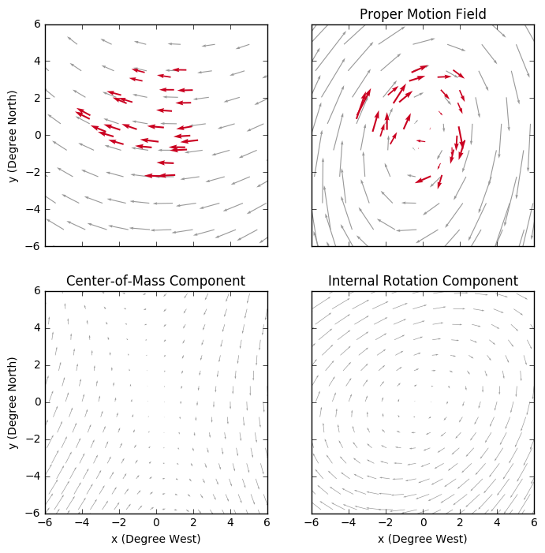

# The Large Magellanic Cloud: Proper Motion and Rotation

The code in this [notebook](https://github.com/pmplewa/Gaia-LMC/blob/master/main.ipynb) reproduces a few key figures and results from a paper by [van der Marel & Sahlmann (2016)](http://iopscience.iop.org/article/10.3847/2041-8205/832/2/L23) on "First Gaia Local Group Dynamics: Magellanic Clouds Proper Motion and Rotation", based on the Tycho-Gaia Astrometric Solution (Gaia DR1).

